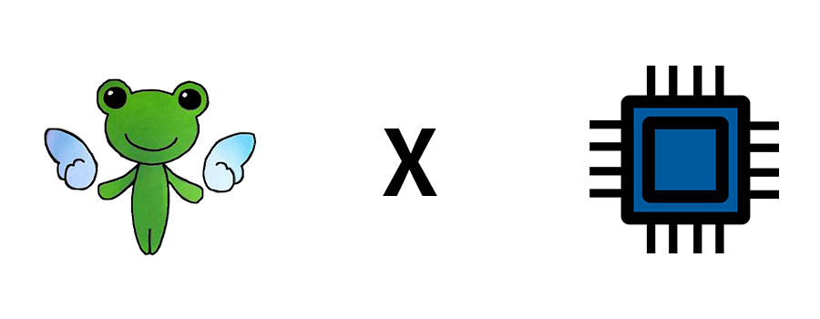
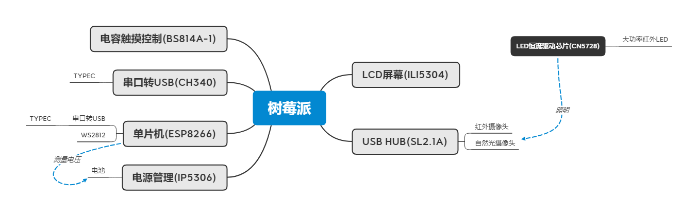
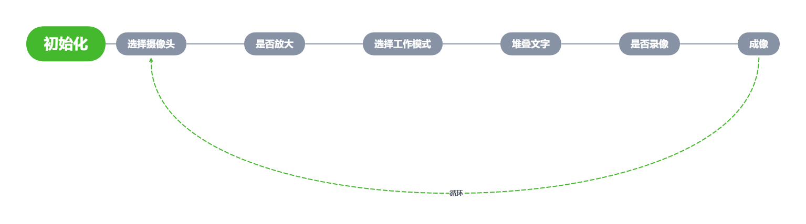

# 御坂妹妹护目镜 X Raspberry Pi

嗨，这是一个基于树莓派的硬核ACG周边制作的项目。其原型是《某科学的超电磁炮》中 *御坂美琴* 的克隆体： *御坂妹妹* 所佩戴的战术护目镜。

本项目在实现还原其外形后还添加了以下功能：

- 夜视
- 人脸探测
- 边缘捕捉
- 录像
- 画面放大

暂时的，功能比较简单。但依赖于树莓派强大的性能，我计划继续在其上添加功能，目前计划添加：

- 人脸识别（可以识别出你是谁）
- 物品识别
- OCR

现阶段为第一次可用的版本，后续改动说明将会更新在本文档末尾。

*有疑惑的地方欢迎提交issue

# 源文件结构

**3DModel**：Solidworks绘制的模型，以及用于3D打印的stl文件。

**Esp8266**：esp8266的Arduino代码

**Raspberrypi**：树莓派的C++程序代码

**python_demo**：初代开发的python代码，与C++功能基本相同。本项目起初采用python开发，后因python的执行效率问题将项目语言改为C++。python代码仅供参考使用。

**PCB**：原理图、Gerber、PCB布局（立创EDA格式）

# 硬件组成

这是主要部分的组成图表。

在本项目中包括了原理图和PCB布局，详细BOM可参见原理图。

*注意，在PCB布局中，ESP8266的GPIO15需要下拉至GND，否则无法正常烧录Arduino程序。在PCB中我忘了画，你可以自行改动或在PCB打板后手动连接。*

## 树莓派

这里树莓派与主板的连接方式为排针连接，可以使用0系列和Model A系列的树莓派。

本项目尝试过使用Raspberry Pi Zero w 和 3A+。

GPIO分配：

BCM 2/3 : 电压数据传输

BCM 17/27/22/10/9/11/8 : LCD显示屏数据传输

BCM 6 : 树莓派工作状态指示

BCM 13/19/26/21 : 触摸按键输入

BCM 20 : 装饰LED开关

BCM 14/15 : 串口通信

## ESP8266

在本项目中，ESP8266作为单片机为树莓派提供电池电压的测量和WS2812的控制。

注意，在PCB布局中，ESP8266的GPIO15需要下拉至GND，否则无法正常烧录Arduino程序。在PCB中我忘了画，你可以自行改动或在PCB打板后手动连接。

其余外围电路均为ESP8266的最小系统电路。

GPIO分配：

GPIO 14/12 : 电压数据传输

ADC : 测量电压

GPIO 2 : 树莓派工作状态指示

GPIO 13 : WS2812控制

## 其余外围芯片

外围芯片电路均按照芯片手册绘制。

## PCB跳线设置

在PCB上我设置了零欧条线，用于开关各个部分的供电。

J_VIN : IP5306的充电跳线，去除后连接USB1将不会对电池充电。

J_5V : IP5306的输出跳线，去除后电池将不会对整个系统供电。

RPI_USB5VIN : USB2的5V供电，在断开J_5V后，可以连接该跳线使用USB2对整个系统供电。

J_WS2812_PWR : WS2812供电

# 软件设计

在树莓派端，采用OpenCV 和 C++ 进行开发，在ESP8266上采用Arduino进行开发。

## 树莓派端

树莓派用到的库：Wiring Pi/Boost/Open CV(3.9.4)

程序执行流程：

**gpio_status**

其中，所有选择信息都被存放在了gpio_status的对象中。

此外，该对象还负责处理触摸芯片传来的电平信号并进行处理：

使用Wiring Pi库配置触摸芯片对应的引脚为下降沿中断，在发生中断时调用在main中绑定的函数进行处理。

**fb-pusher**

该对象负责将OpenCV生成的图像推至/dev/fb*，即Framebuffer。

参考自https://stackoverflow.com/questions/32709175/writing-to-dev-fb0-using-opencv

**voltage_detect**

该对象负责接收单片机传输的电压数据，传输协议是自行编写的一个非常简陋的协议：

在连续传输12个低电平后，确认数据开始传输。

首先传输四位二进制数，表示个位。

其次传输两组四位二进制数分别表示小数点后第一位和后第二位。

这三组二进制数表示出电压的数值。

**video_player**

负责开机动画的播放

**frame_stacker**

负责文字的堆叠

## ESP8266

ESP8266主要负责两件事：电池电压的探测和树莓派工作状态的指示。

在上电时，signal(BCM6-GPIO2)将被上拉，呈高电平状态，表示树莓派未启动。

此时ESP8266将控制WS2812来向用户示意。

在树莓派启动完成后，将会拉低signal(BCM6-GPIO2)，表示树莓派启动完成，ESP8266将关闭WS2812并开始向树莓派传输电压数据。

# 3D模型

3D模型采用SolidWorks绘制 没啥好说的

# 零零碎碎

1）电容触摸芯片的按键去抖不太行，不建议用这款芯片。

2）TYPEC的母座还是卖贵点的好，我买的七毛钱一个的母座到现在插拔已经非常松了。

# 更新

2020/08/05 初版完成